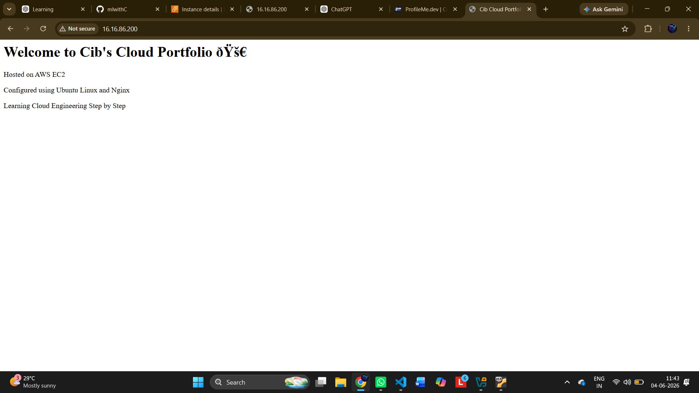
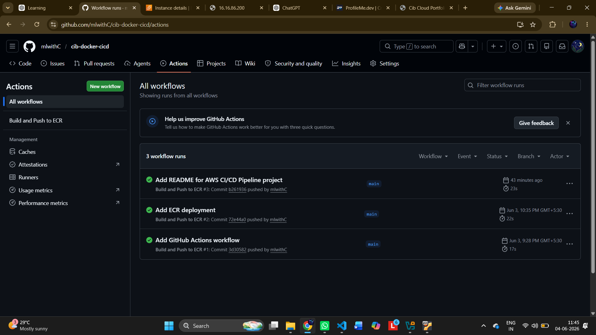
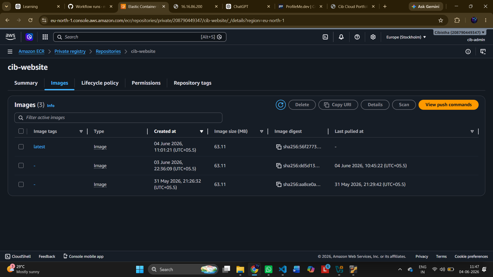
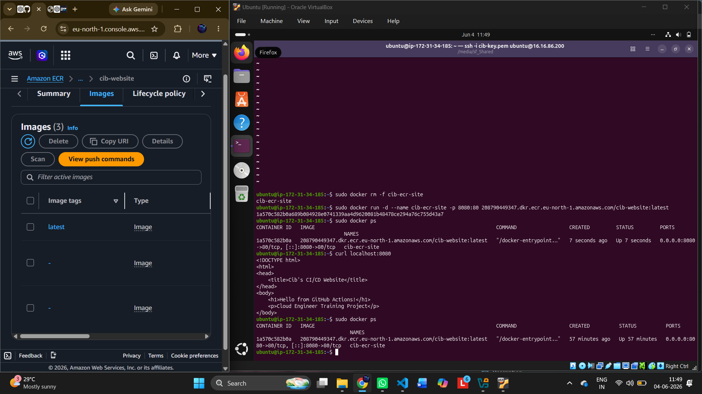
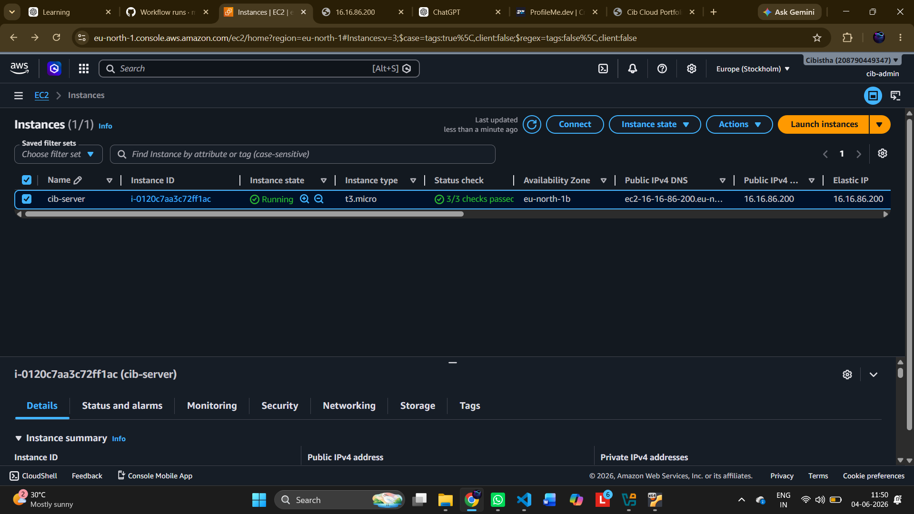

# AWS CI/CD Pipeline with Docker, GitHub Actions & ECR

## 📖 Overview

This project demonstrates a complete CI/CD pipeline using AWS and modern DevOps tools.

The application is containerized using Docker, stored in Amazon Elastic Container Registry (ECR), and automatically built using GitHub Actions.

## 🛠 Technologies Used

* AWS EC2
* AWS ECR
* Docker
* GitHub Actions
* Linux (Ubuntu)
* Git & GitHub
* Nginx

---

## 🏗 Architecture

GitHub Repository

↓

GitHub Actions

↓

Amazon ECR

↓

EC2 Instance

↓

Docker Container

↓

Website

---

## 🚀 Project Workflow

1. Source code stored in GitHub.
2. GitHub Actions automatically triggers on push.
3. Docker image is built.
4. Image is pushed to Amazon ECR.
5. EC2 server pulls image from ECR.
6. Docker container runs the application.
7. Website becomes available to users.

---

## 📸 Screenshots

### Website Running

### GitHub Actions Pipeline

### Amazon ECR Repository

### Docker Container Running

### EC2 Instance

---

## 🎯 Key Learnings

* Docker containerization
* GitHub Actions CI/CD
* Amazon ECR image management
* AWS EC2 deployment
* Linux server administration
* DevOps workflow automation

---

## 📌 Future Improvements

* Terraform Infrastructure as Code
* Kubernetes Deployment
* CloudWatch Monitoring
* Load Balancer Integration
* HTTPS with SSL Certificate

---

